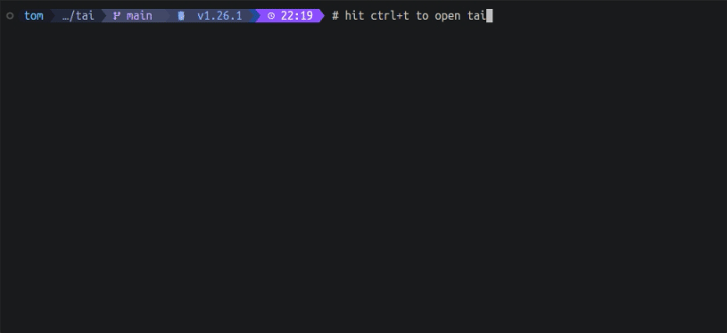

# tai — Terminal AI

You know the command. It does exactly what you need. You just can't remember it. `tai` does. It is for the commands you know exist but can't quite recall. Describe what you want in natural language, get the exact shell command back.



tai uses your GitHub Copilot SDK to suggest commands. Select one, run it, or edit it before executing.

## Features

- **Natural language to shell command** — describe what you want, get back runnable commands
- **Interactive TUI** — keyboard-driven list of suggestions, no mouse required
- **Edit before running** — press `Tab` to tweak a command in-place before execution
- **Follow-up queries** — press `/` to refine results with additional context; conversation history is preserved within the session
- **Destructive command warnings** — commands like `rm` or `kill` are flagged with `⚠`
- **Availability checking** — commands whose binary isn't installed are marked `✘ not installed` and sorted to the bottom
- **Re-query without missing tools** — press `x` on an unavailable command to ask again, explicitly excluding that binary
- **Shell widget** — bind tai to `Ctrl+T` so the chosen command lands in your prompt for editing instead of running immediately
- **Bash and zsh support** — widget and tab completions work in both shells
- **Configurable model** — switch the underlying Copilot model via `tai config set model <name>`

## Prerequisites

- [GitHub Copilot CLI](https://github.com/features/copilot/cli) — installed and logged in (subscription required)

## Installation

```sh
curl -fsSL https://raw.githubusercontent.com/NitorCreations/tai/main/install.sh | sh
```

The binary is placed at `~/.local/share/tai/tai`.

### Add to PATH

Add the install directory to your PATH so you can run `tai` directly:

```sh
export PATH="$HOME/.local/share/tai:$PATH"
```

Add this to `~/.bashrc` or `~/.zshrc` to make it permanent.

### Shell keybinding widget (optional)

`tai widget` prints a shell snippet that defines `_tai_widget` and binds it to `Ctrl+T`. The widget lets tai place a command directly into your prompt line (editable before running) instead of executing it immediately.

```sh
# Load into current shell (one-time)
eval "$(tai widget)"          # auto-detects bash or zsh
eval "$(tai widget bash)"     # explicit
eval "$(tai widget zsh)"      # explicit

# Override the default Ctrl+T binding
eval "$(tai widget bash --key '\C-g')"
eval "$(tai widget zsh  --key '^G')"
```

To persist across sessions, add the eval line to `~/.bashrc` or `~/.zshrc`.

### Tab completions (optional)

To load in the current shell:

```sh
eval "$(tai completion bash)"    # or: tai completion zsh
```

To persist across sessions, add the same line to `~/.bashrc` or `~/.zshrc`.

## Usage

```sh
tai ask                       # open interactive prompt
tai ask "list open ports"     # start with a query pre-filled
```

### TUI key bindings

| State | Key | Action |
|---|---|---|
| Input | `Enter` | Submit query |
| Results | `↑` / `↓` | Navigate suggestions |
| Results | `Enter` | Accept and run command |
| Results | `Tab` | Edit command before running |
| Results | `/` | Follow-up query (refine results) |
| Editing | `Enter` | Run edited command |
| Editing | `Esc` | Cancel edit, back to results |
| Follow-up | `Enter` | Submit follow-up |
| Follow-up | `Esc` / `Ctrl+C` | Back to results |
| Any | `Ctrl+C` | Quit |

Commands marked with `⚠` are flagged as potentially destructive.

## Configuration

Config file: `~/.config/tai/config.json`

```sh
tai config get model           # print current model
tai config set model gpt-4o    # change model
tai config edit                # open in $EDITOR
tai config reset               # restore defaults
```

Default model is `auto` (Copilot selects the model).

## Building from source

```sh
git clone https://github.com/NitorCreations/tai.git
cd tai
make
```

The binary is placed in `dist/`.

## License

MIT — see [LICENSE](LICENSE).
